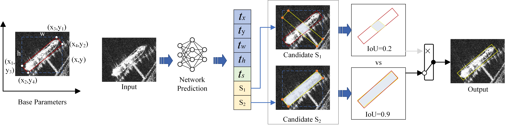
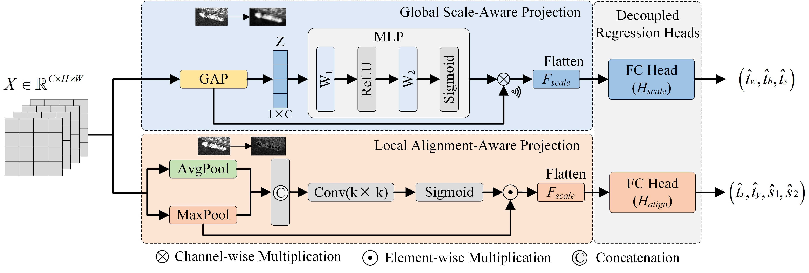

# SOBB: An Analytic Candidate Framework for Reducing Representation Ambiguity and Discontinuity in SAR Ship Detection

## Introduction
SOBB is a rotated object detection framework designed for SAR ship detection. Given an outer horizontal bounding box (HBB) and its empty-area ratio, SOBB solves a polynomial geometric system in closed form and returns an unordered pair of feasible oriented bounding box (OBB) candidates. A weight-shared candidate scorer then selects the output box.



### Key Features
- **Analytic Candidate Representation**: Removes the explicit periodic angle target and makes the unordered candidate-set mapping continuous on the stated nondegenerate domain; hard score-based selection remains discrete at score ties.
- **Task-Specific Feature Routing**: The Decoupled Shape-Orientation Feature (DSOF) module routes shape and alignment cues through dedicated branches without imposing feature orthogonality or claiming statistically independent features.
- **Shape-Assisted Assignment**: The Shape-Assisted Label Assignment (SALA) strategy retains IoU as its localization term and supplements it with occupancy consistency; the occupancy descriptor is neither rotation-invariant nor sufficient on its own.
- **JDet-based**: Implemented on the JDet framework, which is built on the Jittor deep learning framework.

---

## Innovations

### 1. Ship-Oriented Bounding Box (SOBB)
SOBB introduces a 7-parameter vector $(dx, dy, dw, dh, ds, s_1, s_2)$. The first four components follow the standard R-CNN protocol to regress the external HBB. The shape parameter encodes the Area Occupancy Ratio $t_s = 1 - S$, where $S \in [0, 1)$ is the Empty Area Ratio. The network predicts an unconstrained logit $z_s$ and decodes $\hat{t}_s = \mathrm{clip}(\mathrm{sigmoid}(z_s), \epsilon, 1-\epsilon)$. The final two terms $(s_1, s_2)$ are candidate-quality scores for the two analytic candidates. The analytic solution returns two feasible intercept pairs with sign coupling $\sigma(\mathcal{C}_2)$, ensuring both candidates lie in $[0, w] \times [0, h]$.

### 2. Decoupled Shape-Orientation Feature (DSOF)
The DSOF module routes features into two task-specific streams:
- **Scale-Aware Stream**: Focuses on object scale ($dw, dh, ds$) using channel attention.
- **Alignment-Aware Stream**: Focuses on position and candidate scoring ($dx, dy, s_1, s_2$) using spatial attention.

The design does not impose feature orthogonality or claim statistically independent features; capacity-matched and branch-swapping controls test the routing choice.



### 3. Shape-Assisted Label Assignment (SALA)
SALA follows ATSS-style candidate collection but changes the quality statistic used after collection. The matching quality is $Q = \mathrm{IoU}^{\alpha} \cdot C_S^{\beta}$, where $C_S = \mathrm{clip}(1 - |S_{\mathrm{pred}} - S_{\mathrm{gt}}|, 0, 1)$ is the occupancy consistency. The adaptive threshold is $T = \mu_Q + \sigma_Q$. The occupancy descriptor is not rotation-invariant and is not used as a standalone matching criterion; it supplements rather than replaces IoU.

---

## Install

### Requirements
- System: **Linux**, **macOS**, or **Windows Subsystem of Linux (WSL)**
- Python version >= 3.7
- [Jittor](https://github.com/Jittor/jittor) >= 1.3.0

### Installation Steps
1. **Clone the repository**
   ```shell
   git clone https://github.com/ZJ-Song-Lab/SOBB.git
   cd SOBB/SOBB
   ```

2. **Install dependencies**
   ```shell
   python -m pip install -r requirements.txt
   ```

3. **Install SOBB**
   ```shell
   python setup.py develop
   ```

---

## Getting Started

### Datasets
SOBB supports various SAR and aerial datasets:
- **SSDD/SSDD+**: [ssdd.md](docs/ssdd.md) *(primary dataset for SAR ship detection)*
- **DOTA**: [dota.md](docs/dota.md)

### Training
To train a model (e.g., S2A-Net with SOBB) on SSDD:
```shell
python tools/run_net.py --config-file=projects/s2anet/configs/s2anet_r50_fpn_1x_ssdd.py --task=train
```
For SSDD+, replace the config file with `projects/s2anet/configs/s2anet_r50_fpn_1x_ssdd_plus.py`.

### Evaluation
To evaluate a trained model:
```shell
python tools/run_net.py --config-file=projects/s2anet/configs/s2anet_r50_fpn_1x_ssdd.py --task=test
```

### Visualization
To visualize detection results:
```shell
python tools/run_net.py --config-file=projects/s2anet/configs/s2anet_r50_fpn_1x_ssdd.py --task=vis_test
```

> **Note**: Before training, edit the `dataset_dir` paths in the config file to point to your local SSDD/SSDD+ dataset. See [docs/ssdd.md](docs/ssdd.md) for dataset preparation instructions.

---

## Citation
If you find this work helpful, please cite our paper:
```bibtex
@article{sobb2026,
  title={SOBB: An Analytic Candidate Framework for Reducing Representation Ambiguity and Discontinuity in SAR Ship Detection},
  author={Song, Zijing and Zhang, Xiaoyu and Tan, Panlong},
  journal={IEEE Transactions on Aerospace and Electronic Systems},
  year={2026}
}
```
